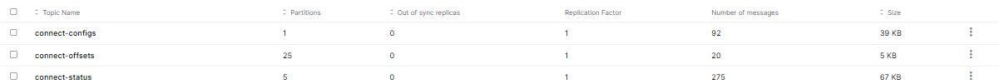
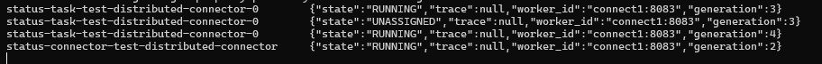

Stand Alone One Connect Worker with multiple tasks

```declarative
┌─────────────────────┐
│   Connect Worker    │
│   (Single Node)     │
│                     │
│  Connector 1        │
│  └─ Task 0          │
│                     │
│  Connector 2        │
│  └─ Task 0          │
└─────────────────────┘
```

Distributed Mode with Multiple Connect Workers and Multiple Tasks

```declarative
┌─────────────────────┐      ┌─────────────────────┐
│   Connect Worker    │      │   Connect Worker    │
│     (Node 1)       │      │     (Node 2)       │
│                     │      │                     │
│  Connector 1        │      │  Connector 1        │
│  └─ Task 0          │      │  └─ Task 1          │
│                     │      │                     │
│  Connector 2        │      │  Connector 2        │
│  └─ Task 0          │      │  └─ Task 1          │
└─────────────────────┘      └─────────────────────┘
│                      │                      │
└──────────────────────┴──────────────────────┘
Shared State via Kafka
(connect-configs, connect-offsets, connect-status)
``` 

Setup wise 
- 2 Additional Connect Workers (JVMs) for 3 worker cluseter
- Internal Topics
- Load Balancer in front of Connect Workers (Optional)
- Monitoring Setup (Optional)

Understanding Current Setup 

```declarative
docker ps | grep connect

docker exec -it kafka cat /etc/kafka-connect/connect-distributed.properties | grep -E "group.id|bootstrap.servers|config.storage|offset.storage|status.storage"
```

Confluent Kafka Connect works based on Environment Variables

Check the kafka-ui and look for following topics 



Update the docker-compose to have multiple kafka connect workers
[docker-compose.yaml](./docker-compose.yaml)

check the status of the connectors
```declarative
# List connectors from worker 1
curl http://localhost:8083/connectors
{"version":"7.6.1-ccs","commit":"11e81ad2a49db00b1d2b8c731409cd09e563de67","kafka_cluster_id":"43toam8dTxC7XkoDk3V_ww"}
# List the same connectors from worker 2
curl http://localhost:8084/connectors
{"version":"7.6.1-ccs","commit":"11e81ad2a49db00b1d2b8c731409cd09e563de67","kafka_cluster_id":"43toam8dTxC7XkoDk3V_ww"}
# List the same connectors from worker 3
curl http://localhost:8085/connectors
{"version":"7.6.1-ccs","commit":"11e81ad2a49db00b1d2b8c731409cd09e563de67","kafka_cluster_id":"43toam8dTxC7XkoDk3V_ww"}
```

Fetch the message from the kafka topic 
```declarative
docker exec -it kafka kafka-console-consumer --bootstrap-server localhost:9092 --topic connect-status --from-beginning --property print.key=true --max-messages 10
```

Create a test-connector 
[test-distributed-connector.json](./test-distributed-connector.json)

Since this connector is to test the distributed mode, we can create it via any of the workers
For time being we need some table to be created in it, 

```declarative
docker exec -it distributedmode-postgres-1 psql -U postgres -d testdb
```


```declarative
-- Create orders table
CREATE TABLE orders (
    order_id SERIAL PRIMARY KEY,
    customer_name VARCHAR(100) NOT NULL,
    product VARCHAR(100) NOT NULL,
    quantity INT NOT NULL,
    price DECIMAL(10,2) NOT NULL,
    order_date TIMESTAMP DEFAULT CURRENT_TIMESTAMP,
    status VARCHAR(20) DEFAULT 'PENDING'
);
```

```declarative
curl -X POST -H "Content-Type: application/json" --data @test-distributed-connector.json http://localhost:8083/connectors
``` 
Check Internal Topics Activity 

```declarative
docker exec -it kafka kafka-console-consumer --bootstrap-server localhost:9092 --topic connect-status --from-beginning --property print.key=true --max-messages 10
```



Check the status of the connector from all workers

```declarative
http://localhost:8083/connectors/test-distributed-connector/status
http://localhost:8084/connectors/test-distributed-connector/status
http://localhost:8085/connectors/test-distributed-connector/status

Response: 

{
  "name": "test-distributed-connector",
  "connector": {
    "state": "RUNNING",
    "worker_id": "connect1:8083"
  },
  "tasks": [
    {
      "id": 0,
      "state": "RUNNING",
      "worker_id": "connect1:8083"
    }
  ],
  "type": "source"
}
```

Verify Group Membership 

```declarative
# Check Kafka consumer group (Connect workers form a consumer group)
docker exec -it <kafka-container-id> kafka-consumer-groups --bootstrap-server localhost:9092 --describe --group connect-cluster

docker exec -it kafka kafka-consumer-groups --bootstrap-server localhost:9092 --describe --group connect-cluster

# Expected: Should show 3 members if all workers are in the cluster
```

How tasks are split (by connector type)
Source connectors

Connector|How work splits
--|-- 
Debezium PG	| Cannot split
JDBC Source | 	Tables / queries
FileSource	| Files

Sink connectors
 
Connector|How work splits
--|--
JDBC Sink|Kafka partitions
S3 |Sink	Kafka partitions

If topic has 1 partition → max 1 task