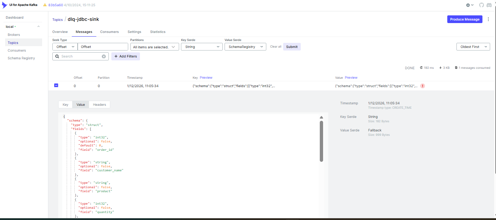
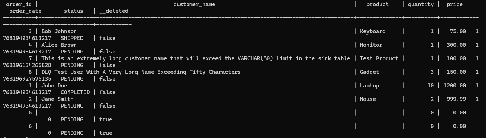
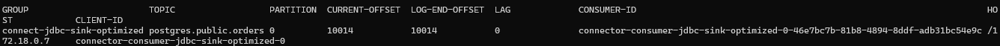
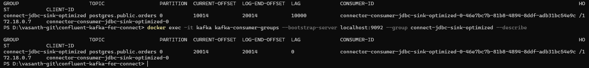
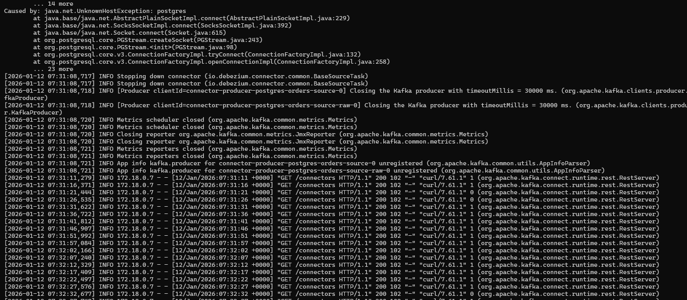

### Sink Connectors 

Kafka Topic (postgres.public.orders) <br>
↓ <br>
Sink Connector  <br>
↓  <br>
Target Database (PostgreSQL/MySQL)  [Error Handling Layer] <br>
↓  <br>
Dead Letter Queue Topic

Source : Postgre SQL Database with orders table <br> will be the Source

**Step 1:** Prepare Target Database (SINK Database)

```declarative
CREATE SCHEMA sink_data;

-- This table will be created automatically by the sink connector
-- But let's verify the schema exists
\dn

-- Create a manual target table (we'll test both auto-create and manual)
CREATE TABLE sink_data.orders_manual (
    order_id INT PRIMARY KEY,
    customer_name VARCHAR(100),
    product VARCHAR(100),
    quantity INT,
    price DECIMAL(10,2),
    order_date TIMESTAMP,
    status VARCHAR(20)
);

-- Create a table for testing updates
CREATE TABLE sink_data.orders_upsert (
    order_id INT PRIMARY KEY,
    customer_name VARCHAR(100),
    product VARCHAR(100),
    quantity INT,
    price DECIMAL(10,2),
    order_date TIMESTAMP,
    status VARCHAR(20),
    last_updated TIMESTAMP DEFAULT CURRENT_TIMESTAMP
);

-- Grant permissions
GRANT ALL PRIVILEGES ON SCHEMA sink_data TO postgres;
GRANT ALL PRIVILEGES ON ALL TABLES IN SCHEMA sink_data TO postgres;

\q
```

**Step 2:** Configure and Deploy Sink Connector

[jdbc-sink-base](./jdbc-sink-basic.json) 

Above file will be added to the Connector to get the logic running behind the scene

Config|Value|What It Does
--|--|--
connector.class|JdbcSinkConnector|JDBC sink connector class
tasks.max|1|Number of tasks to run
topics|postgres.public.orders|Source topic to read from
connection.url|jdbc:postgresql://<SINK_DB_HOST>:5432/sinkdb|JDBC URL for the target database
connection.user|postgres|Database username
connection.password|postgres|Database password
auto.create|true|Automatically create the target table if it doesn't exist
auto.evolve|true|Automatically add columns if schema changes
insert.mode|insert|Insert mode (options: insert, upsert, update)
table.name.format|Table name|Target table (supports ${topic} placeholder)


Create the Connector using the above configuration

```declarative
curl -X POST -H "Content-Type: application/json" \
    --data @jdbc-sink-basic.json \
    http://<CONNECT_HOST>:8083/connectors


curl -X POST -H "Content-Type: application/json" --data @jdbc-sink-basic.json http://localhost:8083/connectors
curl -X GET http://localhost:8083/connectors/jdbc-sink-basic/status
```

Few errors observed due to previous scenario used in cdc-approach

Response is 
```declarative
{
"name": "jdbc-sink-basic",
"connector": {
"state": "RUNNING",
"worker_id": "connect:8083"
},
"tasks": [
{
"id": 0,
"state": "FAILED",
"worker_id": "connect:8083",
"trace": "org.apache.kafka.connect.errors.ConnectException: Exiting WorkerSinkTask due to unrecoverable exception.
\tat org.apache.kafka.connect.runtime.WorkerSinkTask.deliverMessages(WorkerSinkTask.java:632)
\tat org.apache.kafka.connect.runtime.WorkerSinkTask.poll(WorkerSinkTask.java:350)
\tat org.apache.kafka.connect.runtime.WorkerSinkTask.iteration(WorkerSinkTask.java:250)
\tat org.apache.kafka.connect.runtime.WorkerSinkTask.execute(WorkerSinkTask.java:219)
\tat org.apache.kafka.connect.runtime.WorkerTask.doRun(WorkerTask.java:204)
\tat org.apache.kafka.connect.runtime.WorkerTask.run(WorkerTask.java:259)
\tat org.apache.kafka.connect.runtime.isolation.Plugins.lambda$withClassLoader$1(Plugins.java:236)
\tat java.base/java.util.concurrent.Executors$RunnableAdapter.call(Executors.java:515)
\tat java.base/java.util.concurrent.FutureTask.run(FutureTask.java:264)
\tat java.base/java.util.concurrent.ThreadPoolExecutor.runWorker(ThreadPoolExecutor.java:1128)
\tat java.base/java.util.concurrent.ThreadPoolExecutor$Worker.run(ThreadPoolExecutor.java:628)
\tat java.base/java.lang.Thread.run(Thread.java:829)
Caused by: org.apache.kafka.connect.errors.ConnectException: postgres.public.orders.Value (STRUCT) type doesn't have a mapping to the SQL database column type
\tat io.confluent.connect.jdbc.dialect.GenericDatabaseDialect.getSqlType(GenericDatabaseDialect.java:1948)
\tat io.confluent.connect.jdbc.dialect.PostgreSqlDatabaseDialect.getSqlType(PostgreSqlDatabaseDialect.java:340)
\tat io.confluent.connect.jdbc.dialect.GenericDatabaseDialect.writeColumnSpec(GenericDatabaseDialect.java:1864)
\tat io.confluent.connect.jdbc.dialect.GenericDatabaseDialect.lambda$writeColumnsSpec$39(GenericDatabaseDialect.java:1853)
\tat io.confluent.connect.jdbc.util.ExpressionBuilder.append(ExpressionBuilder.java:560)
\tat io.confluent.connect.jdbc.util.ExpressionBuilder$BasicListBuilder.of(ExpressionBuilder.java:599)
\tat io.confluent.connect.jdbc.dialect.GenericDatabaseDialect.writeColumnsSpec(GenericDatabaseDialect.java:1855)
\tat io.confluent.connect.jdbc.dialect.GenericDatabaseDialect.buildCreateTableStatement(GenericDatabaseDialect.java:1772)
\tat io.confluent.connect.jdbc.sink.DbStructure.create(DbStructure.java:121)
\tat io.confluent.connect.jdbc.sink.DbStructure.createOrAmendIfNecessary(DbStructure.java:67)
\tat io.confluent.connect.jdbc.sink.BufferedRecords.add(BufferedRecords.java:122)
\tat io.confluent.connect.jdbc.sink.JdbcDbWriter.write(JdbcDbWriter.java:74)
\tat io.confluent.connect.jdbc.sink.JdbcSinkTask.put(JdbcSinkTask.java:90)
\tat org.apache.kafka.connect.runtime.WorkerSinkTask.deliverMessages(WorkerSinkTask.java:601)
\t... 11 more
"
}
],
"type": "sink"
}
```

Cause of this is due to STRUCT type in the source table which is not mapped in the sink DB

Because the Topic have the following structure 

```declarative
{
  "schema": {
    "type": "struct",
    "fields": [
      {"field": "before", "type": "struct"},  // ← STRUCT type!
      {"field": "after", "type": "struct"},   // ← STRUCT type!
      {"field": "source", "type": "struct"},  // ← STRUCT type!
      {"field": "op", "type": "string"},
      {"field": "ts_ms", "type": "int64"}
    ]
  },
  "payload": {
    "before": {...},
    "after": {...},
    "source": {...},
    "op": "r"
  }
}
```

But JDBC Sink Expect in below format 

```declarative
{
    "order_id": 1,
    "customer_name": "John Doe",
    "product": "Laptop",
    "quantity": 2,
    "price": 1200.50,
    "order_date": 1633036800000,
    "status": "SHIPPED"
}
```
This can be fixed
Solution 1: Use the Unwrapped Topic (Recommended - Easiest)
Solution 2: Add Unwrap Transform to the Sink Connector (Educational)

Adding the Unwrap Transform to the Sink Connector Configuration
```
"transforms": "unwrap",
"transforms.unwrap.type": "io.debezium.transforms.ExtractNewRecordState"
```

Solution 3: Handle Schema Evolution in the Topic (Advanced)

If your topic has mixed schemas (old messages without __op/__before and new messages with them), you need to clean up.

1) Check Your Topic Content
2) If Schemas Are Mixed
    a) Option A: Delete and Recreate the Topic
    b) Option B: Use Schema Evolution Settings

```declarative
"key.converter.schemas.enable": "false",
"value.converter.schemas.enable": "false",    
"transforms": "unwrap",
"transforms.unwrap.type": "io.debezium.transforms.ExtractNewRecordState"
```

Note: I have cleared the topic and re-inserted the data to have a clean schema


**Step 3:** Verify Data in Target Database

```declarative
-- Connect to the sink database
docker exec -it <sink-postgres-container-id> psql -U postgres -d sink
-- Verify data in the automatically created table
-- View data
SELECT * FROM sink_data.orders_auto;

-- Count records
SELECT COUNT(*) FROM sink_data.orders_auto;

-- Compare with source
SELECT COUNT(*) FROM public.orders;
```
Real Time Data Sync 

```declarative
INSERT INTO public.orders (customer_name, product, quantity, price, status) VALUES
('Sink Test User', 'Gadget', 3, 150.00, 'PENDING');

---- Wait for a few seconds and then check the sink table
SELECT * FROM sink_data.orders_auto WHERE customer_name = 'Sink Test User';


```
--------------------------------

Scenario 2: Error Handling with Dead Letter Queue

Learning Objective: 
-   Handle errors gracefully and capture failed records for debugging.

Why Errors Happen
- Data type mismatches: 
- Constraint violations (PRIMARY KEY, UNIQUE, NOT NULL)
- Database connection issues
- Malformed data

Configuration of DLQ 

[jdbc-sink-with-dlq.json](./jdbc-sink-with-dlq.json)

Config|Value|What It Does
--|--|--
connector.class|JdbcSinkConnector|JDBC sink connector class
errors.tolerance|all| Continue processing even on errors (vs none = fail)
errors.log.enable|true|Log errors to Connect worker logs
errors.log.include.messages|true|Include full message in error logs
errors.deadletterqueue.topic.name|dlq-jdbc-sink|Send failed records to this topic
errors.deadletterqueue.context.headers.enable|true|Include error context in DLQ headers

Deploy the Connector

```declarative
# Delete the previous basic connector
curl -X DELETE http://localhost:8083/connectors/jdbc-sink-basic

curl -X POST http://localhost:8083/connectors \
  -H "Content-Type: application/json" \
  -d @jdbc-sink-with-dlq.json

curl http://localhost:8083/connectors/jdbc-sink-with-dlq/status | jq

-- Tested the connector
```
a) Creating the table before Sink connector runs
Will create the table manually with constraints to test the DLQ

```declarative
-- Create table with strict schema
CREATE TABLE sink_data.orders_with_dlq (
    order_id INT PRIMARY KEY,
    customer_name VARCHAR(50),  -- Shorter than source!
    product VARCHAR(100),
    quantity INT,
    price DECIMAL(10,2),
    order_date TIMESTAMP,
    status VARCHAR(20)
);
---

-- Insert a record that violates the customer_name length constraint
INSERT INTO public.orders (customer_name, product, quantity, price, status) VALUES
('DLQ Test User With A Very Long Name Exceeding Fifty Characters', 'Gadget', 3, 150.00, 'PENDING');  -- This will violate the VARCHAR(50) constraint
```

Check the Status of the Connector

```declarative
curl http://localhost:8083/connectors/jdbc-sink-with-dlq/status | jq
``` 



Consume Message from DLQ Topic

```declarative
docker exec -it kafka kafka-console-consumer --bootstrap-server localhost:9092 --topic dlq-jdbc-sink --from-beginning --property print.headers=true --max-messages 1
```
Result in consumption 
```declarative
Headers:
  __connect.errors.topic: postgres.public.orders
  __connect.errors.partition: 0
  __connect.errors.offset: 15
  __connect.errors.connector.name: jdbc-sink-with-dlq
  __connect.errors.task.id: 0
  __connect.errors.stage: VALUE_CONVERTER
  __connect.errors.class.name: org.postgresql.util.PSQLException
  __connect.errors.exception.message: ERROR: value too long for type character varying(50)
```
____________________

Scenario 3: Upsert Mode (Idempotent Writes)

[jdbc-sink-upsert.json](./jdbc-sink-upsert.json)

Learning Objective:
-   Prevent duplicate writes and handle updates correctly.

The Problem with Insert Mode
-- If the same message is replayed (e.g., connector restart)  Insert mode tries to insert AGAIN → PRIMARY KEY violation

config|Value|What It Does
--|--|--
insert.mode|upsert|Use upsert mode to handle duplicates
pk.mode|record_key|Use the record key as the primary key
pk.fields|order_id|Field(s) to use as primary key
delete.enabled|true|Enable handling of delete operations

Deploy it as a New Connector
```declarative
curl -x POST http://localhost:8083/connectors \
  -H "Content-Type: application/json" \
  -d @jdbc-sink-upsert.json
```

Real time Data Sync with Updates

```declarative
-- Initial state
SELECT * FROM sink_data.orders_upsert WHERE order_id = 1;

-- Update the source
UPDATE public.orders SET status = 'COMPLETED', quantity = 10 WHERE order_id = 1;

-- Wait a few seconds, check sink
SELECT * FROM sink_data.orders_upsert WHERE order_id = 1;
```

Test Idempotency (Replay Protection)

```declarative
# Pause the connector
curl -X PUT http://localhost:8083/connectors/jdbc-sink-upsert/pause

# Make changes in source
UPDATE public.orders SET price = 999.99 WHERE order_id = 2;

# Resume connector (it will replay from last offset)
curl -X PUT http://localhost:8083/connectors/jdbc-sink-upsert/resume

# Check sink - should see the update
SELECT * FROM sink_data.orders_upsert WHERE order_id = 2;
```

Key Learning: Upsert mode is idempotent - replaying the same message doesn't create duplicates!

--------------------------------

Scenario 4: Delete Handling (Tombstone Messages)

Learning Objective:
-   Properly handle delete operations from source to sink.

How Delete work in CDC
1) Debezium sends a message with __deleted: "true"
2) Then sends a tombstone (key with null value)
3) Sink connector needs delete.enabled: true

```declarative
-- Delete from source
DELETE FROM public.orders WHERE order_id = 5;

-- Check sink (with delete.enabled: true)
SELECT * FROM sink_data.orders_upsert WHERE order_id = 5;
```
Expected: Row is deleted from sink table too!

What If delete.enabled: false?

Create a connector without delete handling:

[jdbc-sink-no-delete.json](./jdbc-sink-no-delete.json)


To Verify this Operation,we need to have fresh copy of message in topic, otherwise we will get following error

```
Caused by: org.apache.kafka.connect.errors.ConnectException: Sink connector 'jdbc-sink-no-delete' is configured with 'delete.enabled=false' and 'pk.mode=record_key' and therefore requires records with a non-null Struct value and non-null Struct schema, but found record at (topic='postgres.public.orders',partition=0,offset=11,timestamp=1768200062844) with a null value and null value schema.
\tat io.confluent.connect.jdbc.sink.RecordValidator.lambda$requiresValue$2(RecordValidator.java:86)
\tat io.confluent.connect.jdbc.sink.RecordValidator.lambda$and$1(RecordValidator.java:41)
\tat io.confluent.connect.jdbc.sink.BufferedRecords.add(BufferedRecords.java:81)
\tat io.confluent.connect.jdbc.sink.JdbcDbWriter.write(JdbcDbWriter.java:74)
\tat io.confluent.connect.jdbc.sink.JdbcSinkTask.put(JdbcSinkTask.java:90)
\tat org.apache.kafka.connect.runtime.WorkerSinkTask.deliverMessages(WorkerSinkTask.java:601)
```

Fix for this to ignore and proceed further 

Solution: Use Built-in Filter and Predicate Add the following configuration to your JDBC Sink Connector. 

This setup identifies any record with a null value (a tombstone) and drops it before the connector attempts to process it.

Alternative: Install the Confluent Transform Plugin


```declarative
"transforms": "dropTombstones",
"transforms.dropTombstones.type": "org.apache.kafka.connect.transforms.Filter",
"transforms.dropTombstones.predicate": "isTombstone",
"predicates": "isTombstone",
"predicates.isTombstone.type": "org.apache.kafka.connect.transforms.predicates.RecordIsTombstone"


```
Delete the record in Source Table
```declarative
DELETE FROM public.orders WHERE order_id = 6;
```

Result: 



--------------------------------

Scenario: 5 Performance Tuning & Batching for High Throughput

Learning Objective:
- Optimize throughput for high-volume data.

Performance Configurations:
[jdbc-sink-optimized.json](./jdbc-sink-optimized.json)

Create above connector

Config|Default|Optimized|Impact
--|--|--|--
batch.size|3000|5000-10000|Rows per database 
transactionconsumer.max.poll.records|500|1000-5000|Kafka records fetched per poll
tasks.max|1|3-8|Parallel processing (matches topic partitions)

Add the test data to source table

```declarative
Insert many rows quickly
INSERT INTO public.orders (customer_name, product, quantity, price, status)
SELECT 
    'Customer_' || i,
    'Product_' || (i % 10),
    (i % 5) + 1,
    (random() * 1000)::DECIMAL(10,2),
    CASE (i % 3) 
        WHEN 0 THEN 'PENDING'
        WHEN 1 THEN 'SHIPPED'
        ELSE 'COMPLETED'
    END
FROM generate_series(1, 10000) AS i;
```
We can actively monitor the consumer lag and throughput using Kafka Connect REST API or monitoring tools.

Monitor the Consumer Lag
```declarative
docker exec -it kafka kafka-consumer-groups --bootstrap-server localhost:9092 --group connect-jdbc-sink-optimized --describe
```




--------------------------------

Scenario 6: Retry Logic & Transient Failures

Learning Objective
-   Handle temporary database outages gracefully.

[jdbc-sink-with-retries](./jdbc-sink-with-retries)

```declarative
curl -X POST http://localhost:8083/connectors -H "Content-Type: application/json" -d @jdbc-sink-with-retries.json
```

Retry Configurations 

Config|Value|What It Does
--|--|--
errors.retry.timeout|300000 (5 min)|Total time to retry before failing
errors.retry.delay.max.ms|60000 (1 min)|Max backoff between retries
errors.tolerance|all|Continue processing other records

Test Retry Behavior

```declarative
--Deploy the Connector 
curl -X POST http://localhost:8083/connectors -H "Content-Type: application/json" -d @jdbc-sink-with-retries.json
--Check the status of the Connector
curl http://localhost:8083/connectors/jdbc-sink-with-retries/status | jq

# Simulate database failure (Stop Postgresql container)
docker-compose stop postgres

docker-compose up -d postgres

docker exec -it <postgres-container-id> psql -U postgres -d testdb -c \
"SELECT COUNT(*) FROM sink_data.orders_retry;"
```




