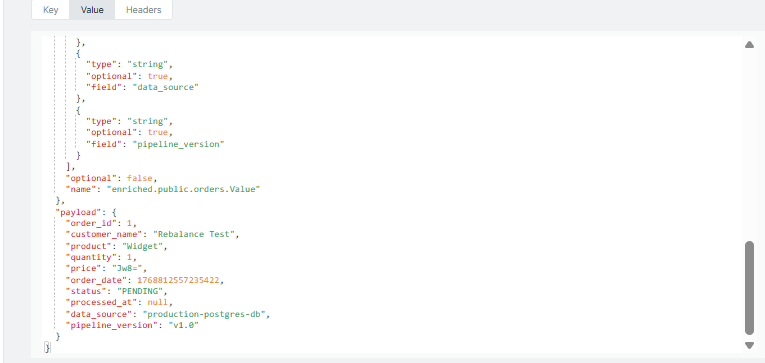
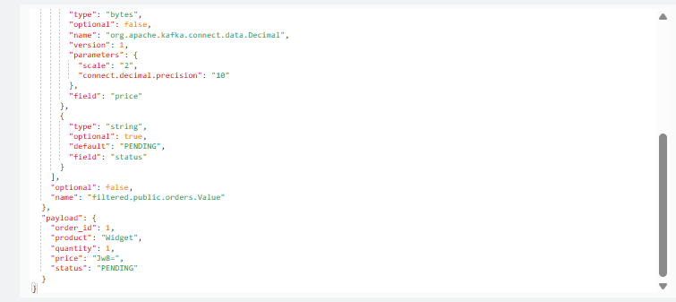
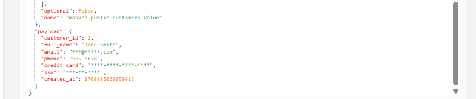

```declarative
Source Database
      ↓
[Source Connector]
      ↓
[SMT Chain: Transform 1 → Transform 2 → Transform 3]
      ↓
Kafka Topic
      ↓
[SMT Chain: Transform A → Transform B]
      ↓
[Sink Connector]
      ↓
Target System
```

#### Single Message Transforms (SMTs) 

They are lightweight transformations that can be applied to individual messages as they flow through Kafka Connect. 
They can be used in both source and sink connectors to modify, filter, or enrich the data.
1) SMTs run inside the connector process (not in Kafka brokers)
2) Can be applied at source (before writing to Kafka) or sink (before writing to target)
3) Executed in order (transform chain matters!)
4) Work on one message at a time (stateless)

### Scenario 1:
Basic Field Transformation

Understand how to add, remove, and modify fields in messages.

-------------   

1a) Add Timestamp and Metadata

Track when records were processed by adding processing timestamp and source information.

[source-with-metadata.json](./postgres-source-with-metadata.json)

```declarative
# Deploy the connector
curl -X POST http://localhost:8083/connectors "Content-Type: application/json" -data @postgres-source-with-metadata.json

# Insert test data
docker exec -it postgres psql -U postgres -d testdb -c \
"INSERT INTO orders (customer_name, product, quantity, price) 
VALUES ('SMT Test User', 'Widget', 1, 99.99);"

# Consume and verify transformations
docker exec -it kafka kafka-console-consumer --bootstrap-server localhost:9092 --topic enriched.public.orders --from-beginning --max-messages 1 
```
Response



-------------

1b) Remove Sensitive Fields
[postgres-source-remove-fields](./postgres-source-remove-fields)

```declarative

curl -X POST -H "Content-Type: application/json" --data @postgres-source-remove-fields.json http://localhost:8083/connectors

docker exec -it kafka kafka-console-consumer --bootstrap-server localhost:9092 --topic filtered.public.orders --from-beginning --max-messages 1

```
Response 



-------------

2) Data Masking and PII Protection 

Mask sensitive information like email addresses or phone numbers to protect user privacy.

2a) Mask Specific Fields

Use Case: Mask credit card numbers, emails, SSNs while keeping data structure.

```declarative
CREATE TABLE public.customers (
    customer_id SERIAL PRIMARY KEY,
    full_name VARCHAR(100),
    email VARCHAR(100),
    phone VARCHAR(20),
    credit_card VARCHAR(16),
    ssn VARCHAR(11),
    created_at TIMESTAMP DEFAULT CURRENT_TIMESTAMP
);

INSERT INTO customers (full_name, email, phone, credit_card, ssn) VALUES
('John Doe', 'john.doe@example.com', '555-1234', '4532123456789012', '123-45-6789'),
('Jane Smith', 'jane.smith@example.com', '555-5678', '5412345678901234', '987-65-4321');

```

Note:
- MaskField$Value replaces field values with static strings
- Multiple mask transforms can be chained
- Original data never reaches Kafka
- Non-reversible masking (data is lost)
- Built-in SMTs don't support partial masking. For production, you'd create a custom SMT. 


Response 



-------

3) Dynamic Topic  Routing Based on Content (Didn't work as expected)

Route messages to different topics based on content.

3a) Route Based on Field Value

Route high-value orders to a priority topic, regular orders to standard topic.

```declarative
curl -X POST -H "Content-Type: application/json" --data @postgres-source-routed.json http://localhost:8083/connectors

```

```declarative
 curl -X POST -H "Content-Type: application/json" --data @postgres-source-content-routed.json http://localhost:8083/connectors
```


Produced following errors post creation of connector:

```declarative
\tat java.base/java.lang.Thread.run(Thread.java:829)
Caused by: java.lang.IllegalArgumentException: No group with name {status}
\tat java.base/java.util.regex.Matcher.appendExpandedReplacement(Matcher.java:1060)
\tat java.base/java.util.regex.Matcher.appendReplacement(Matcher.java:998)
\tat java.base/java.util.regex.Matcher.replaceFirst(Matcher.java:1408)
\tat io.debezium.transforms.ByLogicalTableRouter.determineNewTopic(ByLogicalTableRouter.java:305)
\tat io.debezium.transforms.ByLogicalTableRouter.apply(ByLogicalTableRouter.java:221)
\tat org.apache.kafka.connect.runtime.TransformationStage.apply(TransformationStage.java:57)
\tat org.apache.kafka.connect.runtime.TransformationChain.lambda$apply$0(TransformationChain.java:54)
\tat org.apache.kafka.connect.runtime.errors.RetryWithToleranceOperator.execAndRetry(RetryWithToleranceOperator.java:180)
\tat org.apache.kafka.connect.runtime.errors.RetryWithToleranceOperator.execAndHandleError(RetryWithToleranceOperator.java:214)
\t... 13 more
"
    }
  ],
  "type": "source"

```
Cause of above exception was due to 
```declarative
    "transforms": "unwrap,router",

    "transforms.unwrap.type": "io.debezium.transforms.ExtractNewRecordState",

    "transforms.router.type": "io.debezium.transforms.ByLogicalTableRouter",
    "transforms.router.topic.regex": "content-routed\\.public\\.orders",
    "transforms.router.topic.replacement": "orders-${status}"

```
Alternate Approach tried 
```declarative
// 1st Attempt
"transforms": "unwrap,router",
"transforms.unwrap.type": "io.debezium.transforms.ExtractNewRecordState",
"transforms.router.type": "io.debezium.transforms.ByLogicalTableRouter",
"transforms.router.topic.regex": "content-routed\\.public\\.orders\\.(.*)",
"transforms.router.topic.replacement": "orders-$1"

//2nd Attempt
"transforms": "unwrap,router",
"transforms.unwrap.type": "io.debezium.transforms.ExtractNewRecordState",
"transforms.router.type": "io.debezium.transforms.ByLogicalTableRouter",
"transforms.router.topic.regex": "content-routed\\.public\\.orders\\.(?<status>.*)",
"transforms.router.topic.replacement": "orders-${status}"
```

In both the scenarios above, the intended outcome was to route messages to topics based on the 'status' field value. 
However, the SMT does not support dynamic topic routing based on field values directly.
To route based on record content (field values), you must use the Debezium Content-Based Routing SMT which 
requires a scripting engine like Groovy or GraalVM JS

[link to Debezium Content-Based Routing SMT](https://debezium.io/documentation/reference/stable/transformations/content-based-routing.html)

-----   

4) Filtering Records

Only send specific records to Kafka based on conditions.

[postgres-source-filtered](./postgres-source-filtered.json)

Response on creating the connector:

```declarative
{
  "error_code": 400,
  "message": "Connector configuration is invalid and contains the following 2 error(s)\nInvalid value io.debezium.transforms.Filter for configuration transforms.filter.type: Class io.debezium.transforms.Filter could not be found.\nInvalid value null for configuration transforms.filter.type: Not a Transformation\nYou can also find the above list of errors at the endpoint `/connector-plugins/{connectorType}/config/validate`"
}
```

Before adding the connector configuration, we need to try 
what does the connector-plugin support

Fix :

```declarative
docker exec -it distributedmode-connect1-1 /bin/bash
docker exec -it distributedmode-connect2-1 /bin/bash
docker exec -it distributedmode-connect3-1 /bin/bash

# Copy each JAR into that directory
docker cp debezium-scripting-3.3.1.Final.jar <container_id>:/kafka/connect/debezium-connector-postgres/
docker cp groovy-4.0.26.jar <container_id>:/kafka/connect/debezium-connector-postgres/
docker cp groovy-jsr223-4.0.26.jar <container_id>:/kafka/connect/debezium-connector-postgres/
docker cp antlr4-runtime-4.13.2.jar <container_id>:/kafka/connect/debezium-connector-postgres/

docker cp debezium-scripting-3.4.0.Final distributedmode-connect1-1/usr/share/confluent-hub-components/debezium-debezium-connector-postgresql
docker cp groovy-4.0.26.jar distributedmode-connect1-1:/usr/share/confluent-hub-components/debezium-debezium-connector-postgresql
docker cp groovy-jsr223-4.0.27.jar distributedmode-connect1-1:/usr/share/confluent-hub-components/debezium-debezium-connector-postgresql
docker cp antlr4-runtime-4.13.2.jar distributedmode-connect1-1:/usr/share/confluent-hub-components/debezium-debezium-connector-postgresql

docker cp debezium-scripting-3.4.0.Final.jar  distributedmode-connect2-1:/usr/share/confluent-hub-components/debezium-debezium-connector-postgresql
docker cp groovy-4.0.26.jar distributedmode-connect2-1:/usr/share/confluent-hub-components/debezium-debezium-connector-postgresql
docker cp groovy-jsr223-4.0.27.jar distributedmode-connect2-1:/usr/share/confluent-hub-components/debezium-debezium-connector-postgresql
docker cp antlr4-runtime-4.13.2.jar distributedmode-connect2-1:/usr/share/confluent-hub-components/debezium-debezium-connector-postgresql

docker cp debezium-scripting-3.4.0.Final.jar distributedmode-connect3-1:/usr/share/confluent-hub-components/debezium-debezium-connector-postgresql
docker cp groovy-4.0.26.jar distributedmode-connect3-1:/usr/share/confluent-hub-components/debezium-debezium-connector-postgresql
docker cp groovy-jsr223-4.0.27.jar distributedmode-connect3-1:/usr/share/confluent-hub-components/debezium-debezium-connector-postgresql
docker cp antlr4-runtime-4.13.2.jar distributedmode-connect3-1:/usr/share/confluent-hub-components/debezium-debezium-connector-postgresql

```

As above approach is not a proper way of adding the JARs to all the Connect workers in a distributed mode.
1) A better approach is to create a custom Docker image including the required JARs and use that OR
2) Mount the jars via volume mounts to all the Connect worker containers

```declarative
    volumes:
      - "./custom_lib:/usr/share/java/custom-libs"
    command:
      - bash
      - -c
      - |
        confluent-hub install --no-prompt debezium/debezium-connector-postgresql:2.5.4        
        confluent-hub install --no-prompt confluentinc/kafka-connect-jdbc:10.7.4  
        cp /usr/share/java/custom-libs/*.jar /usr/share/confluent-hub-components/debezium-debezium-connector-postgresql/
        
        /etc/confluent/docker/run
```

Post performing the above steps, restart all the Connect workers and then try creating the connector again.

```declarative
curl -X POST -H "Content-Type: application/json" --data @postgres-source-filtered.json http://localhost:8083/connectors
``` 
Response on consuming from topic:

```declarative
docker exec -it kafka kafka-console-consumer --bootstrap-server localhost:9092 --topic filtered.public.orders --from-beginning --max-messages 2
```

------

Scneario 5: Sink-Side Transformations

Apply transformations before writing to target system.

[jdbc-sink-with-transforms](./jdbc-sink-with-transforms.json)
```declarative

```

