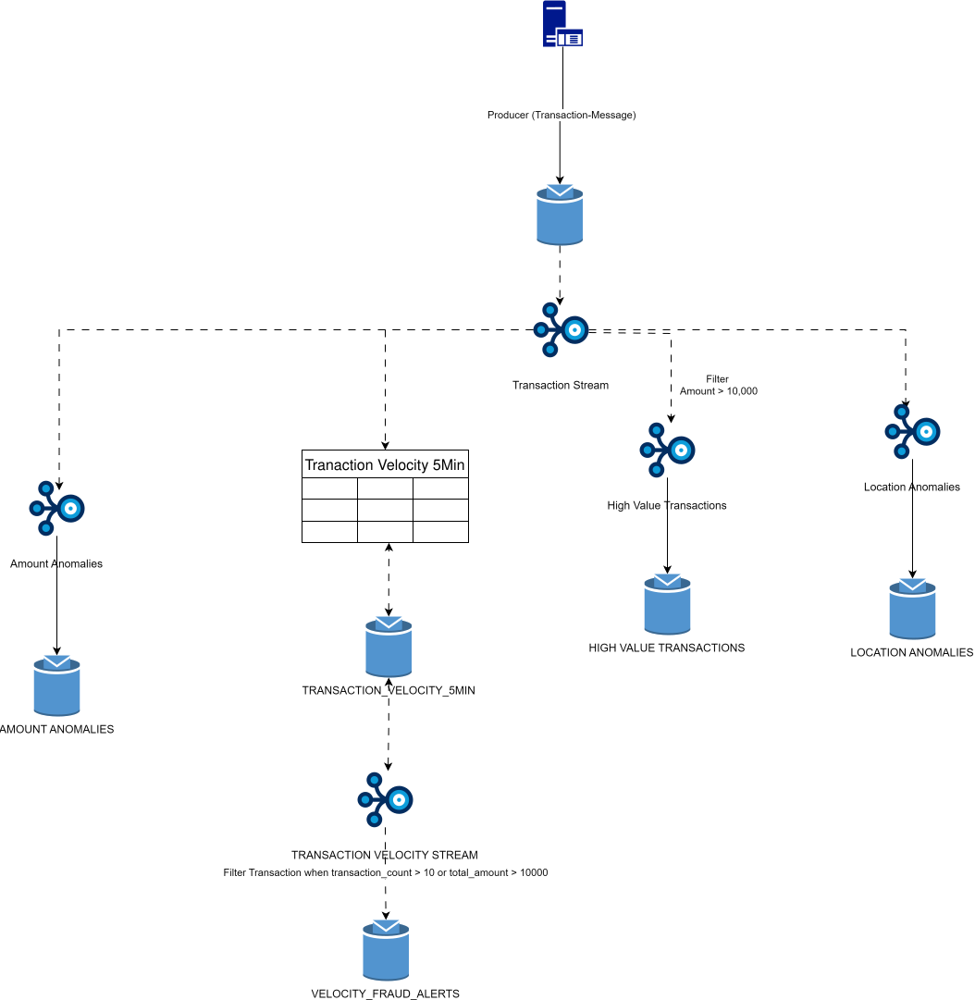
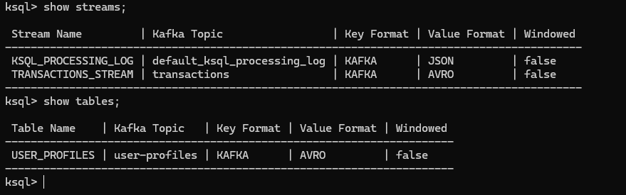
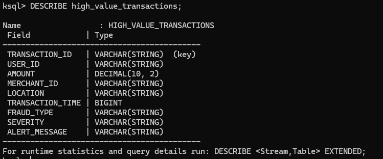

### Use Case: Real-Time Fraud Detection with ksqlDB

Idea to detect fraudulent transactions in real-time using ksqlDB.

#### Overview 
- In this use case, we will create a real-time fraud detection system that analyzes incoming transaction data to identify potentially fraudulent activities. The system will use ksqlDB to process and analyze the data in real-time.
- Find fraudlent transactions in real time for an e-commerce platform processing million of transactions daily 


#### Components
- Kafka Topics
- Kafka Streams
- Schema Registry
- Kafka Connect
- ksqlDB

Note: 
- Create Stream From a Topic: Registers a new stream that reads from an existing Kafka topic.
- Create Table From a Topic: Registers a new table that reads from an existing Kafka topic.
- Create Stream From a Stream: Creates a new stream based on the results of a query against an existing stream. By having filters on the stream, we can isolate specific events of interest, 
such as high-value transactions or transactions from unusual locations.
- Create Table From a Stream: Creates a new table based on the results of a query against an existing stream. This is useful for aggregating data, such as counting the number of transactions per user or calculating average transaction amounts over time.
- Create Stream From a Table: Creates a new stream based on the contents of an existing table. This can be used to generate alerts or notifications based on aggregated data, such as flagging users with unusually high transaction volumes.

Scenario| What does Kafka Do?                                                                | If Topic Present               | If Topic Not Present 
--|------------------------------------------------------------------------------------|--------------------------------|--
Create Stream From a Topic | If Command has, WITH(Topic='Topic_Name')                                           | It will Map to Topic if Exists | It Will Auto Create Topic
Create Stream From a Topic | If Command doesn't have, WITH(Topic='Topic_Name') | It will Map                    | It Will Auto Create often match with Stream Name
Create Table From a Topic  | If Command has, WITH(Topic='Topic_Name')





1. Register the Schema
[./schema/transaction-schema.avsc](./schema/transaction-schema.avsc)
[./schema/user-profile-value.avsc](./schema/user-profile-value.avsc)
```declarative
# Register transaction schema
curl -X POST -H "Content-Type: application/vnd.schemaregistry.v1+json" --data @schema/transaction-value.avsc http://localhost:8081/subjects/transactions-value/versions

# Register user profile schema
curl -X POST -H "Content-Type: application/vnd.schemaregistry.v1+json" --data @schema/user-profile-value.avsc http://localhost:8081/subjects/user-profiles-value/versions

# Verify registration
curl http://localhost:8081/subjects

```

2. Execute the DDL 

[./scripts/01-create-streams-tables.sql](./scripts/01-create-streams-tables.sql)

```sql
# Connect to ksqlDB CLI
docker exec -it ksqldb-cli ksql http://ksqldb-server:8088

# Run the script
RUN SCRIPT '/path/to/scripts/01-create-streams-tables.sql';

# Or execute commands manually by copying from file
```

Response should be 



3. Implementation

Rule 1: High-Value Transaction Detection
```declarative
-- Create high-value transactions stream
CREATE STREAM high_value_transactions AS
SELECT
    transaction_id,
    user_id,
    amount,
    merchant_id,
    location,
    transaction_time,
    'HIGH_VALUE' as fraud_type,
    'HIGH' as severity,
    CONCAT('Amount exceeds threshold: $', CAST(amount AS VARCHAR)) as alert_message
FROM transactions_stream
WHERE amount > 10000
EMIT CHANGES;

-- Verify stream creation
DESCRIBE high_value_transactions;

```

Validation:
```sql
-- Check if stream is processing
SELECT * FROM high_value_transactions EMIT CHANGES LIMIT 5;
```
Response



Rule 2: Velocity-Based Fraud Detection


```sql
-- Create velocity tracking table
CREATE TABLE transaction_velocity_5min AS
SELECT 
    user_id,
    COUNT(*) as transaction_count,
    SUM(amount) as total_amount,
    COLLECT_LIST(transaction_id) as transaction_ids,
    AS_VALUE(user_id) as user_id_copy,
    WINDOWSTART as window_start,
    WINDOWEND as window_end
FROM transactions_stream
WINDOW TUMBLING (SIZE 5 MINUTES)
GROUP BY user_id
EMIT CHANGES;

```

```sql
-- Create velocity-based fraud alerts
CREATE STREAM velocity_fraud_alerts AS
SELECT 
    user_id,
    transaction_count,
    total_amount,
    transaction_ids,
    'VELOCITY_FRAUD' as fraud_type,
    CASE 
        WHEN transaction_count > 20 OR total_amount > 100000 THEN 'CRITICAL'
        WHEN transaction_count > 10 OR total_amount > 50000 THEN 'HIGH'
        ELSE 'MEDIUM'
    END as severity,
    CONCAT('Transactions in 5min: ', CAST(transaction_count AS VARCHAR), 
           ', Total: $', CAST(total_amount AS VARCHAR)) as alert_message,
    window_start,
    window_end
FROM transaction_velocity_5min
WHERE transaction_count > 10 OR total_amount > 50000
EMIT CHANGES;
```
Running the above query will result in an Exception 

```declarative
Could not determine output schema for query due to error: KSQL does not support persistent queries on windowed tables.

Reason for this erorr : 

Windowed Table Restriction: ksqlDB cannot create a new persistent stream (CREATE STREAM AS SELECT) or table that uses a 
windowed table as its source. Windowed tables are considered "terminal" objects for persistent processing because 
their underlying state stores have specific retention policies that ksqlDB cannot currently propagate to 
downstream persistent queries.

```

Fix we can make is like
- Manually Map a Stream to the Output Topic
- Create the Fraud Alerts from the new stream

```declarative
CREATE STREAM transaction_velocity_stream (
    user_id_copy VARCHAR,
    transaction_count BIGINT,
    total_amount DOUBLE,
    transaction_ids ARRAY<VARCHAR>,
    window_start BIGINT,
    window_end BIGINT
) WITH (
    KAFKA_TOPIC='TRANSACTION_VELOCITY_5MIN',
    VALUE_FORMAT='JSON'
);

CREATE STREAM velocity_fraud_alerts AS
SELECT
    user_id_copy AS user_id,
    transaction_count,
    total_amount,
    transaction_ids,
    'VELOCITY_FRAUD' as fraud_type,
    CASE
        WHEN transaction_count > 20 OR total_amount > 100000 THEN 'CRITICAL'
        WHEN transaction_count > 10 OR total_amount > 50000 THEN 'HIGH'
        ELSE 'MEDIUM'
    END as severity,
    window_start,
    window_end
FROM transaction_velocity_stream
WHERE transaction_count > 10 OR total_amount > 50000
EMIT CHANGES;

```


**Rule 3: Location Anomaly Detection**

```sql
-- Create location-based fraud detection stream
CREATE STREAM location_anomalies AS
SELECT 
    t.transaction_id,
    t.user_id,
    t.location as transaction_location,
    u.home_location,
    t.amount,
    t.transaction_time,
    'LOCATION_ANOMALY' as fraud_type,
    CASE 
        WHEN t.amount > u.avg_transaction_amount * 5 THEN 'HIGH'
        WHEN t.amount > u.avg_transaction_amount * 3 THEN 'MEDIUM'
        ELSE 'LOW'
    END as severity,
    CONCAT('Transaction from ', t.location, ' (home: ', u.home_location, 
           '), amount $', CAST(t.amount AS VARCHAR)) as alert_message
FROM transactions_stream t
LEFT JOIN user_profiles u ON t.user_id = u.user_id
WHERE t.location != u.home_location 
  AND t.amount > u.avg_transaction_amount * 3
EMIT CHANGES;
```

**Rule 4: Amount Anomaly Detection**

```sql
-- Create amount anomaly detection stream
CREATE STREAM amount_anomalies AS
SELECT 
    t.transaction_id,
    t.user_id,
    t.amount,
    u.avg_transaction_amount,
    (t.amount / u.avg_transaction_amount) as deviation_ratio,
    t.transaction_time,
    'AMOUNT_ANOMALY' as fraud_type,
    CASE 
        WHEN t.amount > u.avg_transaction_amount * 10 THEN 'CRITICAL'
        WHEN t.amount > u.avg_transaction_amount * 5 THEN 'HIGH'
        ELSE 'MEDIUM'
    END as severity,
    CONCAT('Amount $', CAST(t.amount AS VARCHAR), 
           ' is ', CAST((t.amount / u.avg_transaction_amount) AS VARCHAR), 
           'x user average') as alert_message
FROM transactions_stream t
INNER JOIN user_profiles u ON t.user_id = u.user_id
WHERE t.amount > u.avg_transaction_amount * 5
EMIT CHANGES;
```

----------------
Testing 
-----------------

1. Test High-Value Transaction Detection
```sql
INSERT INTO TRANSACTIONS_STREAM (
    TRANSACTION_ID, 
    USER_ID, 
    AMOUNT, 
    MERCHANT_ID, 
    LOCATION, 
    TRANSACTION_TIME, 
    CARD_LAST_FOUR
) VALUES (
    'test_txn_001',
    'test_user_001',
    15000.00,
    'test_merchant',
    'Test City',
    UNIX_TIMESTAMP() * 1000,
    '1234'
);
```